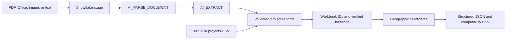

# Snowflake documents to project JSON

This package owns the beginning of the ingestion pipeline. It uploads documents to a Snowflake
internal stage, calls `AI_PARSE_DOCUMENT` in LAYOUT mode through the SQL REST API,
then calls `AI_EXTRACT` on bounded text sections to obtain construction project fields.
Pydantic validates and normalizes the resulting records before exporting JSON.

The existing workbook identity matcher, conservative endpoint resolver and geographic
overlap calculation are reused. The module has no FastAPI, ADK, or A2A imports;
an agent can call `extract_document(path, client)` or `run_pipeline(...)` directly.
`backend.projectdata` now composes this parser with separate Snowflake reference/upload
databases, BallTree collision matching, upload API routes, and an A2A retrieval tool.
See [the project dataset pipeline](../projectdata/README.md) for setup and commands.

## Pipeline ownership



`snowflake.py` owns upload and SQL API calls; `extraction.py` owns document validation,
page handling and typed project extraction; `pipeline.py` owns orchestration and JSON
export. `records.py`, `locations.py`, and `collisions.py` contain the reused project rules.
The canonical package has no imports from `pdfparsing` or local PDF extraction libraries.

Both CLI names and the previous Python `run(args)` entry point use this one pipeline.
`backend.pdfparsing` is a compatibility entry point only. Its local PDF extraction
implementation has been removed; there is no offline PDF extraction fallback.

## Install

Use Python 3.12 and a dedicated environment. The Snowflake connector currently requires
`filelock<4`, while the existing backend lock pins `filelock==4.0.3`. Do not install these
requirements over the app's hash-locked environment. The source `pyproject.toml` and
`uv.lock` for that app are absent in this checkout, so its lock exports are unchanged.

Run from the repository root:

```powershell
py -3.12 -m venv .venv-documents
.\.venv-documents\Scripts\python.exe -m pip install -r backend/requirements-documentparsing.txt
.\.venv-documents\Scripts\python.exe -m backend.documentparsing capabilities
```

Supported Cortex inputs: PDF, DOCX, PPTX, PNG, JPG/JPEG, TIF/TIFF, UTF-8 TXT and HTML.
Files must be nonempty and smaller than 100,000,000 bytes. PDF/DOCX/PPTX use page splitting;
the other formats do not. Snowflake's document/page/resolution restrictions still apply.
An extension/signature check runs before upload; Snowflake performs full document validation.

The sponsor-format XLSX and projects CSV use deterministic import, without Cortex calls.
XLSX must have the existing `projects` and `overlaps` sheets. CSV must contain
`project_id`, `project_name`, `utility`; it may contain the scalar project fields, including
state, endpoint names/coordinates, ISO or US dates, and numeric dollar amounts. These are
structured project imports, not arbitrary spreadsheet layout interpretation.

## Configure Snowflake

Set the names from `.env.example` in the shell. The CLI does not load `.env` automatically.
Do not commit a token. `SNOWFLAKE_ACCOUNT` is `organization-account` (not an https URL).
Database, schema, warehouse, stage and role names are unquoted SQL identifiers.

```powershell
$env:SNOWFLAKE_ACCOUNT = "organization-account"
$env:SNOWFLAKE_USER = "CONSTRUCTION_APP"
$env:SNOWFLAKE_WAREHOUSE = "COMPUTE_WH"
$env:SNOWFLAKE_ROLE = "CONSTRUCTION_APP_ROLE"
# Supply SNOWFLAKE_TOKEN through your secret manager or current process environment.
# Optional: SNOWFLAKE_DATABASE, SNOWFLAKE_SCHEMA, SNOWFLAKE_STAGE,
#           SNOWFLAKE_STATEMENT_TIMEOUT (seconds, default 300).
.\.venv-documents\Scripts\python.exe -m backend.documentparsing setup
```

Defaults are `CONSTRUCTION_COLLAB.APP.DOCUMENTS_STAGE`. `setup` uses `CREATE ... IF NOT EXISTS`
for the database, schema and server-side-encrypted internal stage. It does not replace
objects, create a warehouse or grant privileges. A setup role needs object creation rights;
the runtime role needs warehouse/database/schema access, stage READ/WRITE, and permission
to use Cortex AI functions. The account must support both functions in its region or have
appropriate cross-region inference configured. No account policies are changed by this CLI.

Snowflake's SQL REST API cannot execute file-transfer PUT. The official Python connector
is therefore used only for upload; SQL REST handles all parsing, extraction and setup queries.
Both use the same server-side programmatic access token. PUT results are checked for an
actual successful transfer. Filenames are content-addressed, retain their extension and
use `AUTO_COMPRESS=FALSE`. Uploaded originals remain on the configured stage.

## Run

```powershell
.\.venv-documents\Scripts\python.exe -m backend.documentparsing run --input "C:\plans\utility-a.pdf" --input "C:\plans\utility-b.docx" --starter-workbook "C:\plans\Projects_Overlaps.xlsx" --output-dir backend/documentparsing/outputs
```

Use `--utility "Utility Name" --state SC` only for a run whose source documents omit
that metadata and all belong to that utility/state. Extracted values take precedence.
Unknown utility/date/location values remain missing and are reported for review.

The previous command still works and now uses Snowflake:

```powershell
.\.venv-documents\Scripts\python.exe -m backend.pdfparsing run --dominion-pdf "C:\plans\dominion.pdf" --starter-workbook "C:\plans\Projects_Overlaps.xlsx" --output-dir backend/documentparsing/outputs
```

`--dominion-pdf` supplies Dominion Energy South Carolina / SC as missing-metadata defaults.
Use repeated `--input` for multiple utilities. `--audit-pdf` parses an additional PDF in
Snowflake and reports its pages without extracting projects.

Geocoding remains offline by default. `--osm-snapshot path.json` uses an existing Overpass
snapshot. `--refresh-locations --user-agent "App/1.0 (contact: address)"` explicitly enables
live cache misses. Seed coordinates are trusted; model output never invents coordinates.
The inherited OSM resolver targets Georgia/South Carolina. Elsewhere, provide verified
coordinates through the structured inputs. OSM attribution is included in the audit.

## Outputs and contract

| File | Content |
| --- | --- |
| `projects.json` | Typed project records, nullable missing fields, source references and warnings. |
| `overlaps.json` | All geographic candidate pairs in the workbook's nine-column format. |
| `workbook.json` | `{ "projects": [...], "overlaps": [...] }`, matching the worksheet structure. |
| `extraction_audit.json` | Document hashes/stage paths, retained parsed text, raw extraction responses and skipped pages. |
| `pipeline_audit.json` | Counts, eligibility IDs, exclusions, rules, warnings and geocoder diagnostics. |
| `location_review.json` | Unresolved/ambiguous endpoint matches from the existing resolver. |
| `collisions.csv` | Compatibility input for the current similarity CLI/service. |

The overlap fields are `overlap_id`, `distance_mi`, `time_gap (day)`, `utility_a`,
`project_id_a`, `project_name_a`, `utility_b`, `project_id_b`, `project_name_b`.
JSON distances/counts are numbers, dates are ISO strings, and unknown values are `null`.
`workbook.json` includes at least `overlap_1` through `overlap_3`, extending beyond three
when needed. Its overlap references contain the other project's ID.

Geographic candidates use different utilities and an unrounded center distance below
25 miles. `pipeline_audit.json.eligible_overlap_ids` additionally applies a date gap of
at most 365 days. This is an in-service-date proxy, not confirmed construction overlap.
Missing or ambiguous dates/locations are excluded from candidate calculation with reasons.
Workbook overlap IDs are preserved; new IDs are stable hashes of the project pair.

The extractor requests project identity, owner, scope, endpoint names, status, dates,
voltage, length and explicitly stated total/previous cost. Annual cost schedules and user
resource-budget breakdowns are not inferred. Costs with unknown units stay null. Conflicting
dates and numeric facts across sections are retained as warnings instead of silently selected.
Source references identify the page window and character range used for extraction;
they are not model-certified per-field citations. Overlapping page windows preserve context.

CEII-marked content is excluded after Snowflake parsing, before field extraction and local
JSON export. The original uploaded file is still processed/stored in Snowflake. This matches
the application's field-exclusion rule; it is not a pre-upload document-redaction service.

All documents must finish before export. Extraction/validation failures leave existing
outputs untouched. Files are serialized to a temporary directory then individually replaced;
the directory is not a database transaction, so consumers should read after the command exits.
Repeated executions reuse content-addressed staged files but currently rerun Cortex queries.

## Tests

```powershell
.\.venv-documents\Scripts\python.exe -m unittest discover -s backend/documentparsing/tests -v
```

Offline tests mock only the provider boundary and HTTP transport. They exercise parsing
options, retries/polling, typed normalization, multi-page merging, exclusions, workbook
identity preservation, JSON/CSV output and failed-run preservation.
They also verify equivalent exports through both CLI names and run the canonical CLI
with the legacy parser and local PDF libraries blocked. Set `GRIDLOCK_INPUT_DIR` to a
folder containing `Projects_Overlaps.xlsx` to include the supplied-workbook checks.

After `setup`, enable the separate live smoke test to upload a small synthetic TXT document
and incur Cortex usage. It leaves its content-addressed file in the configured stage:

```powershell
$env:RUN_SNOWFLAKE_LIVE = "1"
.\.venv-documents\Scripts\python.exe -m unittest discover -s backend/documentparsing/tests -p test_live.py -v
Remove-Item Env:RUN_SNOWFLAKE_LIVE
```

Provider errors exit with code 2. Check the configured Snowflake role, stage, warehouse,
Cortex availability and Snowflake query history when troubleshooting. The CLI does not
log tokens, request headers or connection strings.

Official references: [AI_PARSE_DOCUMENT](https://docs.snowflake.com/en/sql-reference/functions/ai_parse_document),
[AI_EXTRACT](https://docs.snowflake.com/en/sql-reference/functions/ai_extract),
[SQL API limitations](https://docs.snowflake.com/en/developer-guide/sql-api/intro),
[PAT authentication](https://docs.snowflake.com/en/user-guide/programmatic-access-tokens).
